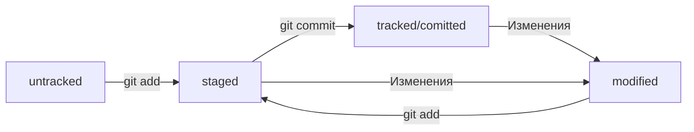

----
# Шпаргалка. 
## Базовые команды в консоли
##### Навигация
* pwd (от англ. _print working directory_, «показать рабочую папку») — покажи, в какой я папке;
* ls (от англ. _list directory contents_, «отобразить содержимое директории») — покажи файлы и папки в текущей папке;
* ls -a — покажи также скрытые файлы и папки, названия которых начинаются с символа .;
* cd first-project (от англ. _change directory_, «сменить директорию») — перейди в папку first-project;
* cd first-project/html — перейди в папку html, которая находится в папке first-project;
* cd .. — перейди на уровень выше, в родительскую папку;
* cd ~ — перейди в домашнюю директорию (/Users/Username);
* cd / — перейди в корневую директорию.
##### Работа с файлами и папками
###### Создание
* touch index.html (англ. _touch_, «коснуться») — создай файл index.html в текущей папке;
* touch index.html style.css script.js — если нужно создать сразу несколько файлов, можно напечатать их имена в одну строку через пробел;
* mkdir second-project (от англ. _make directory_, «создать директорию») — создай папку с именем second-project в текущей папке.
###### Копирование и перемещение
* cp file.txt ~/my-dir (от англ. _copy_, «копировать») — скопируй файл в другое место;
* mv file.txt ~/my-dir (от англ. _move_, «переместить») — перемести файл или папку в другое место.
###### Чтение
* cat file.txt (от англ. concatenate and print, «объединить и распечатать») — распечатай содержимое текстового файла file.txt.
###### H6 Удаление
* rm about.html (от англ. _remove_, «удалить») — удали файл about.html;
* rmdir images (от англ. _remove directory_, «удалить директорию») — удали папку images;
* rm -r second-project (от англ. _remove_, «удалить» + _recursive_, «рекурсивный») — удали папку second-project и всё, что она содержит.
##### Полезные возможности
Команды необязательно печатать и выполнять по очереди. Можно указать их списком — разделить двумя амперсандами (__&&__).
У консоли есть собственная память — буфер с несколькими последними командами. По ним можно перемещаться с помощью клавиш со стрелками вверх (__↑__) и вниз (__↓__).
Чтобы не вводить название файла или папки полностью, можно набрать первые символы имени и дважды нажать Tab. Если файл или папка есть в текущей директории, командная строка допишет путь сама.
Например, вы находитесь в папке dev. Начните вводить __cd first__ и дважды нажмите Tab. Если папка first-project есть внутри dev, командная строка автоматически подставит её имя. Останется только нажать __Enter__.

----

## Что такое хеш. 
##### Хеширование коммитов
**Хеширование** (от англ. hash, «рубить», «крошить», «мешанина») — это способ преобразовать набор данных и получить их «отпечаток» (англ. fingerprint).
Информация о коммите — это набор данных: когда был сделан коммит, содержимое файлов в репозитории на момент коммита и ссылка на предыдущий, или родительский (англ. parent), коммит.
Git хеширует (преобразует) информацию о коммите с помощью алгоритма SHA-1 (от англ. Secure Hash Algorithm — «безопасный алгоритм хеширования») и получает для каждого коммита свой __уникальный хеш__ — результат хеширования.
Обычно **хеш** — это короткая (40 символов в случае SHA-1) строка, которая состоит из цифр 0—9 и латинских букв A—F (неважно, заглавных или строчных). Она обладает следующими важными свойствами:
* если хеш получить дважды для одного и того же набора входных данных, то результат будет гарантированно одинаковый;
* если хоть что-то в исходных данных поменяется (хотя бы один символ), то хеш тоже изменится (причём сильно).
Чтобы убедиться в этом, можно поэкспериментировать с SHA-1 на этом сайте — попробуйте ввести в поле input (англ. «ввод») разные символы, слова или предложения и понаблюдайте, как меняется хеш в поле output (англ. «вывод»).
###### Хеш — основной идентификатор коммита
Git хранит таблицу соответствий хеш → **информация о коммите**. Если вы знаете хеш, вы можете узнать всё остальное: автора и дату коммита и содержимое закоммиченных файлов. Можно сказать, что хеш — основной идентификатор коммита.
При работе с Git хеши будут встречаться вам регулярно. Их можно будет передавать в качестве параметра разным Git-командам, чтобы указать, с каким коммитом нужно произвести то или иное действие.
Все хеши и таблицу хеш → информация о коммите Git сохраняет в служебные файлы. Они находятся в скрытой папке .git в репозитории проекта.

----

##Лог
Сокращённый лог (от англ. log — «журнал [записей]») полезен, если нужно быстро найти нужный коммит среди сотни других.
*Элементы*, из которых состоит описание:
* строка из цифр и латинских букв после слова commit — это хеш коммита;
* Author — имя автора и его электронная почта;
* Date — дата и время создания коммита;
* в конце находится сообщение коммита.
*Получить* сокращённый лог — __git log --oneline__

----

## HEAD
##### Файл HEAD
Файл HEAD (англ. «голова», «головной») — один из служебных файлов папки **.git**. Он указывает на коммит, который сделан последним (то есть на самый __новый__).
В этом можно убедиться с помощью терминала. Перейдите в папку .git командой **cd**. Посмотрите содержимое файла HEAD командой **cat**.
Внутри HEAD — __ссылка на служебный файл__: refs/heads/master (или refs/heads/main в зависимости от названия ветки). Если заглянуть в этот файл, можно увидеть хеш последнего коммита.
Вместо хеша последнего коммита можно написать слово **HEAD** — Git вас поймёт.

----

## Статусы файлов в Git
##### Статусы untracked/tracked, staged и modified
Одна из ключевых задач Git — отслеживать изменения файлов в репозитории. Для этого каждый файл помечается каким-либо статусом. Рассмотрим основные.
* __untracked__ (англ. «неотслеживаемый»)
Git «видит», что такой файл существует, но не следит за изменениями в нём. У untracked-файла нет предыдущих версий, зафиксированных в коммитах или через команду git add.
* __staged__ (англ. «подготовленный»)
После выполнения команды git add файл попадает в staging area (от англ. stage — «сцена», «этап [процесса]» и area — «область»), то есть в список файлов, которые войдут в коммит. В этот момент файл находится в состоянии **staged**.
__Staging area, index и cache__
Staging area также называют index (англ. «каталог») или cache (англ. «кеш»), а состояние файла staged иногда называют indexed или cached.
Все три варианта могут встречаться в документации и в качестве флагов команд Git. А также в интернете — например, в вопросах и ответах на сайте Stack Overflow.
* tracked (англ. «отслеживаемый»)
это противоположность untracked. Оно довольно широкое по смыслу: в него попадают файлы, которые уже были зафиксированы с помощью git commit, а также файлы, которые были добавлены в staging area командой git add. То есть все файлы, в которых Git так или иначе отслеживает изменения.
* modified (англ. «изменённый»)
Состояние modified означает, что Git сравнил содержимое файла с последней сохранённой версией и нашёл отличия. Например, файл был закоммичен и после этого изменён.
Для файлов в состояниях staged и modified обычно не указывают, что они также tracked, потому что это состояние подразумевается.
###### Про staged и modified
Команда **git add** добавляет в staging area только текущее содержимое файла. 
Git сообщит об этом с помощью статуса modified: файл изменён относительно той версии, которая уже в staging. Чтобы добавить в staging последнюю версию, нужно выполнить git add file.txt ещё раз.
###### Типичный жизненный цикл файла в Git
HEAD -- это голова.
Коммит -- это всему голова.
Статусы файлов:

1. Файл только что создали. Git ещё не отслеживает содержимое этого файла. Состояние: untracked.
2. Файл добавили в staging area с помощью git add. Состояние: staged (+ tracked).
* Возможно, изменили файл ещё раз. Состояния: staged, modified (+ tracked).
* Обратите внимание: staged и modified у одного файла, но у разных его версий.
* Ещё раз выполнили git add. Состояние: staged (+ tracked).
3. Сделали коммит с помощью git commit. Состояние: tracked.
4. Изменили файл. Состояние: modified (+ tracked).
5. Снова добавили в staging area с помощью git add. Состояния: staged (+ tracked).
6. Сделали коммит. Состояния: tracked.
7. Повторили пункты 4 − 7 много-много раз.

----

## Оформление сообщений к коммитам
Сообщение должно быть:
* относительно коротким, чтобы его было легко прочитать;
* информативным.
#### Стили оформления
Чтобы упростить работу, команды или даже целые компании часто договариваются об определённом стиле (то есть о правилах) оформления сообщений коммитов.
Например, правила могут быть такие: 
* длина сообщения от 30 до 72 символов;
* первое слово — глагол в инфинитиве («исправить», «дополнить», «добавить» и другие);
##### Подходы к оформлению сообщений коммитов.
Их используют как отдельные команды, так и целые проекты.
###### Корпоративный
Во многих компаниях применяется __Jira__ — система для организации проектов и задач. У каждой задачи в Jira есть идентификатор из нескольких заглавных латинских букв и номера. Например, LGS-239 значит, что это 239-я задача в проекте LGS (сокращение от англ. logistics — «логистика»).
В корпоративном стиле в начале сообщения обычно указывают **Jira-ID**, а после — текст сообщения.
Пример : $ git commit -m "LGS-239: Дополнить список пасхалок новыми числами" 
###### Conventional Commits
**Стандарт Conventional Commits** (англ. «соглашение о коммитах») отличается качественной документацией и подробной проработкой. Он подходит для репозиториев с исходным кодом программ. Использовать его для других типов проектов (например, для перевода книги) было бы неудобно.
Conventional Commits предлагает такой формат коммита: **<type>: <сообщение>**. Первая часть **type** — это тип изменений. Таких типов достаточно много. Вот два примера:
* feat (сокращение от англ. feature) — для новой функциональности;
* fix (от англ. «исправить», «устранить») — для исправленных ошибок.
Например, сообщение может быть таким.
git commit -m "feat: добавить подсчёт суммы заказов за неделю" 
###### GitHub-стиль
GitHub можно использовать не только для хранения файлов проекта, но и для ведения списка **задач** (англ. issue) этого проекта. Если коммит __«закрывает»__ или «решает» какую-то задачу, то в его сообщении удобно указывать ссылку на неё. Для этого в любом месте сообщения нужно указать **#<номер задачи>**. Например, вот так.
$ git commit -m "Исправить #334, добавить график температуры" 
В таком случае GitHub свяжет коммит и задачу.
* Инфинитив и императив
Для сообщений на русском языке часто рекомендуют использовать инфинитивы. Например: Добавить тесты для PipkaService, Исправить ошибку #123 и так далее.
Для сообщений на английском рекомендуется использовать **повелительное наклонение** (англ. imperative). Например: Use library mega_lib_300, Fix exit button и так далее.
Эти рекомендации сложились исторически, и им следуют многие проекты.
